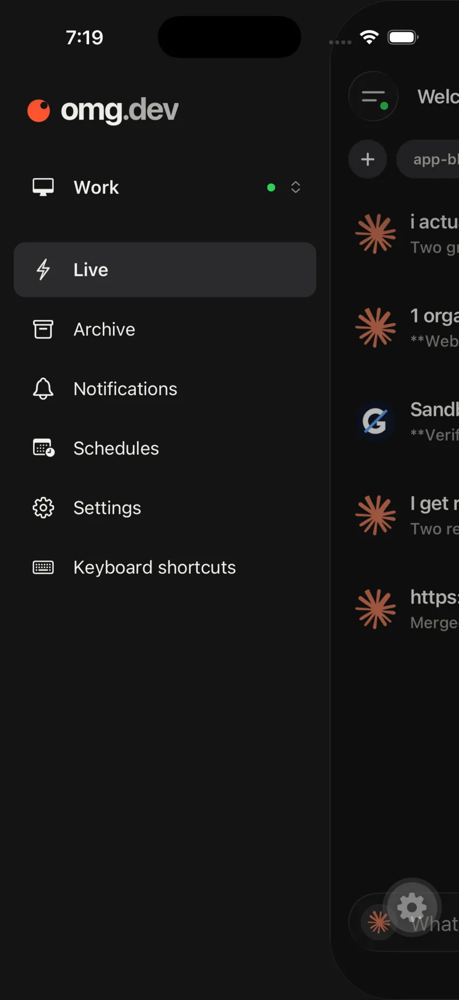
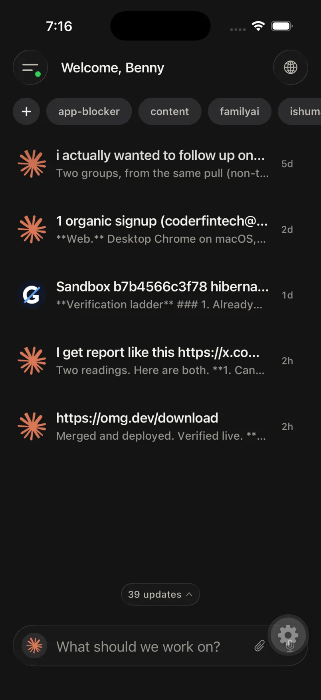
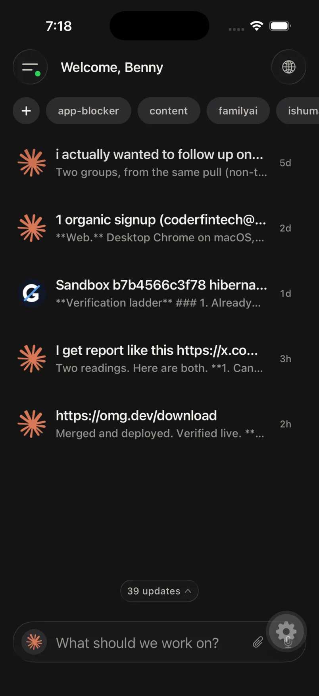
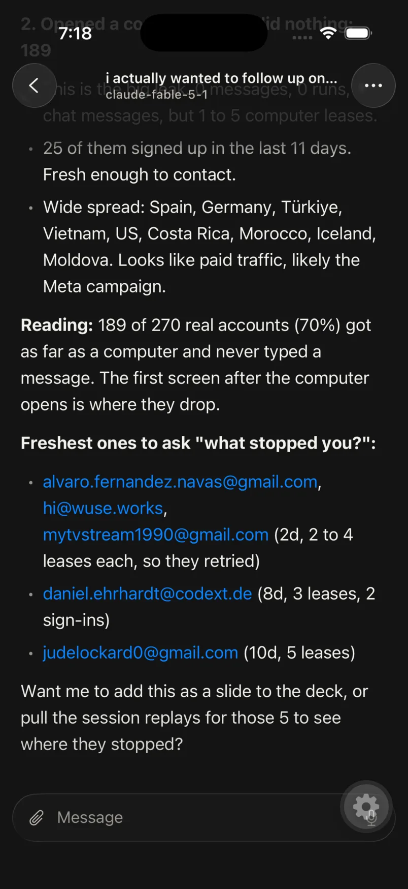

<a href="https://omg.dev">
  
</a>

# omg.dev

**Not 10 interfaces. One portal for all your agents.**

Open-source parallel coding agent harness. Run agents on your computer.
Control them from one UI. Install locally, or start with a hosted Computer.

[](./LICENSE)
[](https://github.com/BennyKok/omg.dev/releases)
[](https://github.com/BennyKok/omg.dev/releases/download/desktop-preview/macos-arm64-omg.dev.dmg)
[](https://apps.apple.com/us/app/omg-dev/id6800792515)
[](https://omg.dev/discord)

<p align="center">
  
  &nbsp;
  
</p>

## Install on your computer

```bash
bun install --global @omg-dev/cli && omg computer setup
```

Open [http://localhost:8766](http://localhost:8766).

Debian, Ubuntu, or macOS. No omg.dev account. On Linux, a normal user with
`sudo`. Do not run as `root`.

Open **Settings → Coding agents**. Supports Claude Code, Codex, Grok, Cursor,
omg agent, OpenCode, fx, Muse, DeepSeek, Devin, Jcode, Copilot, and Pi. Sign in
with the agent provider.

### Try the macOS desktop preview

Apple Silicon. Ships with its own runtime. No separate CLI install.

[**Download omg.dev for macOS →**](https://github.com/BennyKok/omg.dev/releases/download/desktop-preview/macos-arm64-omg.dev.dmg)

Unsigned preview. Control-click the app, choose **Open**, then **Open** again.
Or **System Settings → Privacy & Security → Open Anyway**.

## Use the hosted version

No local server. Runs in the cloud, opens in the browser.

[**Start with a hosted Computer →**](https://app.omg.dev/)

iPhone: [omg.dev on the App Store](https://apps.apple.com/us/app/omg-dev/id6800792515)

## Built for every role

PMs, engineers, growth, and sales share the same sessions.

<table>
  <tr>
    <td width="50%">
      
      <p><strong>PM.</strong> Needs you, Working, Idle, Shipped.</p>
    </td>
    <td width="50%">
      
      <p><strong>Engineer.</strong> Worktree diff, then merge.</p>
    </td>
  </tr>
  <tr>
    <td width="50%">
      
      <p><strong>Growth.</strong> Ask in chat. Chart from your database.</p>
    </td>
    <td width="50%">
      
      <p><strong>Sales.</strong> Calls to objections, risk, follow-ups.</p>
    </td>
  </tr>
</table>

<p align="center">
  
  
  
  
</p>

## What you get

- Several coding-agent sessions in parallel.
- Transcripts and follow-ups in the web UI.
- Chat, Bots, Schedules, and Notifications in one place.
- Managed sessions keep running when the UI disconnects.
- Your existing agent subscriptions or API keys.

## Remote access and security

The local server binds to `127.0.0.1` and has no built-in authentication. Do
not expose it to the public internet.

Phone access through Tailscale:

```bash
OMG_TAILSCALE_SERVE=1 omg computer setup
```

Sign in to Tailscale if setup asks. See [remote access](./docs/remote-access.md)
and [SECURITY.md](./SECURITY.md) before you share access.

## Manage a local install

```bash
omg computer status    # check the install
omg computer update    # install the latest release
omg doctor             # create a sanitized diagnostic report
omg computer uninstall # remove omg.dev and keep sessions and config
```

## Develop from source

```bash
git clone https://github.com/BennyKok/omg.dev.git
cd omg.dev
bun install
cp .env.example .env
bun run serve
```

API is at [http://localhost:8766](http://localhost:8766). For the UI, run
`cd web && bun run dev` in another terminal. `bun run serve` alone needs a
built `web/dist`.

Desktop shell: [desktop development](./desktop/README.md).

Read [CONTRIBUTING.md](./CONTRIBUTING.md) before a pull request. Help:
[Discord](https://omg.dev/discord).

## License

[MIT](./LICENSE)
